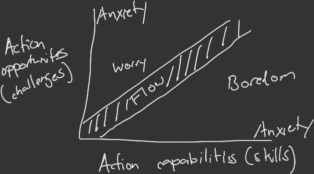

# Beyond Boredom and Anxiety: Experiencing Flow in Work and Play
__By: Mihaly Csikszentmihalyi__
## Lessons Learned:
- There is a downward spiral with extrinsic motivation, working for money and material things. You need more stuff to be happy, so you work more, but you are motivated by money as well, so you work to get the money. If you were intrinsically motivated you wouldn’t need to work for something, the act of work is motivating enough
- Enjoyable activities must involve a person's physical, sensory, or intellectual skills. And, it must give that person a feeling of being in control of his/her actions
- Basic requirement of autotelic activity: provide challenge
	- Either the challenge of the unknown (discovery, exploration, problem solving) or challenge of competition 
- In flow the objective is not necessarily the end of the work, but rather to continue to do the work
- To experience flow there has to be some form of challenge as well as some sort of feedback
- Don't do it for fame and money, do it because you love it
- Skills and challenges are measured based on the person's perceptions of their skill level and the difficulty of the activity.

- Flow does have some addictive qualities. People can get so into whatever things get them into the flow state, that everything else, normal life, is no longer important. During flow, the rest of the world can float away, this can be dangerously close to the use of alcohol or drugs. 
- Microflow experiences can help keep people alert, relaxed, feel positive about him/herself, a feeling of being spontaneously creative. 
	- Microflow activities are small, almost automatic behavior patterns which are not extrinsically rewarded yet appear to have necessary function. Examples of microflow activities: 
		- Imagining: Daydreaming, music in head, talking to self, plants or pets, humming, whistling, or singing
		- Attending: Watching people or things, watching TV, listening to radio or records, reading books, magazines, or paper
		- Oral: Snacking, smoking, or chewing
		- Kinesthetic: Walking, pacing, running, small muscle movements, touching, rubbing, fiddling with objects, playing games or sports alone.
		- Creative: Doing art work, playing a musical instrument, sewing, writing a letter, or doodling
		- Social: Browsing, shopping, talking or joking with others, social events, eating, parties, sexual activity
- Without them (microflow experiences) a person falls out of the balanced state of interaction with the environment. No longer feels any sense of control. 
- People in more control in their work and social lives rely les on these microflow experiences. 
- Finding differences in free vs. unfree society lies in our ability to discover freedom in our labor, not beyond it.
- The importance of control over the environment cannot be understated in its importance to flow and overall well being
- One needs to grow, to develop new skills, to take on new challenges to maintain a self-concept as a fully functioning human being
	- People fall back on extrinsic rewards if they don't have this growth
	- Find things you want to grow in. What do you want to learn more about?
		- Super important in raising children! 
- Work and play don't have to be two completely different things. Realize that work is not necessarily more important than play and that play isn't necessarily more enjoyable than work. 
- Action and doing things is very important in the feeling of happiness. 