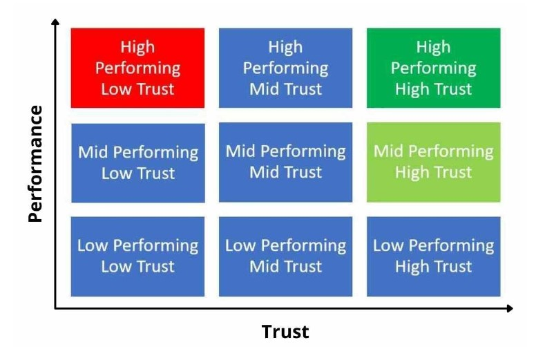

# The Infinite Game
__By: Simon Sinek__
## Lessons Learned:
- Finite games are played by known players. They have fixed rules. And there is an agreed-upon objective that, when reached, ends the game. Football,for example, is a finite game.
- Infinite games, in contrast, are played by known and unknown players. There are no exact or agreed-upon rules. Though there may be conventions or laws that govern how the players conduct themselves, within those broad boundaries, the players can operate however they want. And if they choose to break with convention, they can. The manner in which each player chooses to play is entirely up to them. And they can change how they play the game at any time, for any reason. Infinite games have infinite time horizons. And because there is no finish line, no practical end to the game, there is no such thing as “winning” an infinite game. In an infinite game, the primary objective is to keep playing, to perpetuate the game.                
- To succeed in the Infinite Game of business, we have to stop thinking about who wins or who’s the best and start thinking about how to build organizations that are strong enough and healthy enough to stay in the game for many generations to come.                
- While a finite-minded leader works to get something from their employees, customers and shareholders in order to meet arbitrary metrics, the infinite-minded leader works to ensure that their employees, customers and shareholders remain inspired to continue contributing with their effort, their wallets and their investments.                
- CEO Carl Elsener says, “When you look at the history of world economics, it was always like this. Always! And in the future, it will always be like this. It will never go only up. It will never go only down. It will go up and down and up and down. . . . We do not think in quarters,” he says. “We think in generations.”                 
- Growth through acquisition or merger often becomes the only way mature, finite-minded companies can continue to demonstrate high rates of growth. This may win a short-term boost in the stock market; however, as Harvard Business Review and many others have reported, “70%–90% of acquisitions are abysmal failures.”
- It’s a strange quirk of human nature. The order in which a person presents information more often than not reveals their actual priorities and the focus of their strategies.               
- Any leader who wants to adopt an infinite mindset must follow five essential practices: 
    1. Advance a Just Cause Build
    2. Trusting Teams
    3. Study your Worthy Rivals
    4. Prepare for Existential Flexibility
    5. Demonstrate the Courage to Lead                
1. A Just Cause is a specific vision of a future state that does not yet exist; a future state so appealing that people are willing to make sacrifices in order to help advance toward that vision.                
    - Think of the WHY like the foundation of a house, it is the starting point. It gives whatever we build upon it strength and permanence. Our Just Cause is the ideal vision of the house we hope to build. We can work a lifetime to build it and still we will not be finished.                
    - A Just Cause must be: For something—affirmative and optimistic Inclusive—open to all those who would like to contribute Service oriented—for the primary benefit of others Resilient—able to endure political, technological and cultural change Idealistic—big, bold and ultimately unachievable                
    - Money is the fuel to advance a Cause, it is not a Cause itself. The reason to grow is so that we have more fuel to advance the Cause.                
    - Words matter. They give direction and meaning to things. Pick the wrong words, intentions change and things won’t necessarily go as hoped or expected. Martin Luther King Jr. gave the “I have a dream” speech, for example. He didn’t give the “I have a plan” speech. There is no doubt he needed a plan. We know he had meetings to discuss the plan. But as the “CEO” of the civil rights movement, Dr. King was not responsible for making the plan. He was responsible for the dream and making sure those responsible for the plans were working to advance the dream.                
    - A CVO is not an operations or a finance job. Whereas CVOs focus on up and out, CFOs and COOs focus on down and in. One requires eyes on the infinite horizon, the other requires eyes on the business plan. One envisions the very distant, abstract future. The other sees the steps to take in the tangible near term.                
    - The responsibility of business is to use its will and resources to advance a cause greater than itself, protect the people and places in which it operates and generate more resources so that it can continue doing all those things for as long as possible. An organization can do whatever it likes to build its business so long as it is responsible for the consequences of its actions.                
    - In any game, there are always two currencies required to play: will and resources. Resources are tangible and easily measured. When we talk about resources, we’re usually talking about money. Will, in contrast, is intangible and harder to measure. When we talk about will, we’re talking about the feelings people have when they come to work. Will encompasses morale, motivation, inspiration, commitment, desire to engage, desire to offer discretionary effort and so on.                
    - The finite-minded leader tends to show a bias for the score. As a result, they often opt for choices that demonstrate results in a short time frame, even if doing so, “regrettably,” comes at a cost to the people. Infinite-minded leaders, in contrast, work hard to look beyond the financial pressures of the current day and put people before profit as often as possible. In hard times, they are less likely to look at their people as just another expense to be cut and more willing to explore other ways to save money,                
2. Feelings are at the heart of Trusting Teams . . . and Trusting Teams, it turns out, are the healthiest and highest-performing kind of teams.
            
    - What the SEALs discovered is that the person in the top left of the graph—the high performer of low trust—is a toxic team member. These team members exhibit traits of narcissism, are quick to blame others, put themselves first, “talk shit about others” and can have a negative influence on their teammates, especially new or junior members of the team. The SEALs would rather have a medium performer of high trust, sometimes even a low performer of high trust (it’s a relative scale), on their team than the high performer of low trust.                
    - Some tricks to help build trust on the team. To help them feel safe from humiliation, for example, he depersonalized the problems his executives faced. “You have a problem,” he would tell them. “You are not the problem.”                
    - CRPD officers’ evaluations focus on the problems they are solving and the impact they are making in the lives of people at the department and in the community.                
    - One problem solved at a time. It’s a system that promotes consistency over intensity.                
    - The ability to succeed is not what makes someone a leader. Exhibiting the qualities of leadership is what makes someone an effective leader. Qualities like honesty, integrity, courage, resiliency, perseverance, judgment and decisiveness, as the Marines have learned after years of trial and error, are more likely to engender the kind of trust and cooperation that, over the course of time, increase the likelihood that a team will succeed more often than it fails.                
    - Leaders are not responsible for the results, leaders are responsible for the people who are responsible for the results. And the best way to drive performance in an organization is to create an environment in which information can flow freely, mistakes can be highlighted and help can be offered and received.                
    - Ethical fading is a condition in a culture that allows people to act in unethical ways in order to advance their own interests, often at the expense of others, while falsely believing that they have not compromised their own moral principles. Ethical fading often starts with small, seemingly innocuous transgressions that, when left unchecked, continue to grow and compound.                
    - When we use process and structure to fix cultural problems what we often get is more lying and cheating.                
3. Worthy Rival- We don’t need to admire everything about them, agree with them or even like them. We simply acknowledge that they have strengths and abilities from which we could learn a thing or two.                
    - Traditional competition forces us to take on an attitude of winning. A Worthy Rival inspires us to take on an attitude of improvement.                
4. Existential Flexibility is the capacity to initiate an extreme disruption to a business model or strategic course in order to more effectively advance a Just Cause.                
5. The courage to see the Infinite Game—to see the purpose of business as something more heroic than simply making money, even if it’s unpopular with the finite players around us—is hard. True Courage to Lead holds the company and its leadership to a much higher standard than simply acting within the bounds of the law.