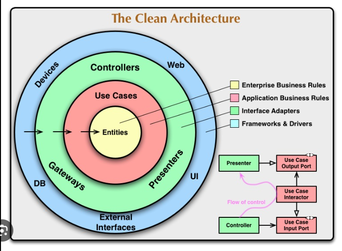

# Clean Architecture: A Craftsman's Guide to Software Structure and Design
__By: Robert Martin__
## Lessons Learned:
- The goal of software architecture is to minimize the human resources required to build and maintain the required system
- the most important aspect of software is that it is easy to update and make changes to. This is why clean architecture is so important, itsets the tone for how easy or difficult the software is to change in the future.
- event sourcing is a strategy wherein we store the transactions, but never the state. When state is required, we apply all the transactions from the beginning of time. Requires near infinite storage and processing power.
- solid principles
    - SRP - the single responsibility principle
        - separate the code that different actors depend on
    - OCP. - the open closed principle
        - Software artifact should be open to addition, but closed to modification
    - LSP - the liskov substitution principle
        - if we substitute a superclass object reference with an object of *any* of its subclasses, the program should not break
    - ISP - the interface segregation principle
        - Clients should not be forced to depend upon interfaces that they do not use.
    - DIP - the dependency inversion principle
        - High-level modules, which provide complex logic, should be easily reusable and unaffected by changes in low-level modules, which provide utility features. To achieve that, you need to introduce an abstraction that decouples the high-level and low-level modules from each other.
- components are the smallest entitles that can be deployed as part of the system. For example, DLL files in - net and jar files in java. They should be capable of independent deployment and development
- component cohesion
    - The reuse / release equivalence principle (REP)
        - Code should not be reused by copying it from one class and pasting it into another. If the original author fixes any bugs in the code, or adds any features, you will not automatically get the benefit. You will have to find out what's changed, then alter your copy. Your code and the original code will gradually diverge. Instead, code should be reused by including a released library in your code. The original author retains responsibility for maintaining it; you should not even need to see the source code.
        - classes and modules that are formed into a component must belong to a cohesive group.
    - The common closure principle (CCP)
        - gather into components those classes that change for the same reasons and at the same times.
    - The common reuse principle (CRP)
        - don't force users of a component to depend on things they don't need.
    - each of these principles are slightly at odds with each other, thus a balance of all three is required and might change over time
- directed acyclic graph (DAG)
    - makes sure there are no cyclical dependencies and each component of a system is a separate entity and has its own version number
- stable dependencies principle
    - ensure that modules that are easy to change do not depend on produces that are harder to change
- The ultimate goal of an architect is to minimize the lifetime cost of the system and to maximize programmer productivity
- good architects de-couples policy and the details. The policy element includes all the business rules, logic, and procedures. The details are the bits that allow people or other systems to communicate with the policy. Examples of the details include io devices, databases, web systems, servers, frameworks, communication protocols, etc.
- A few of the systems horizontal layers include the UI, application-specific business rules, application - independent business rules, and the database. You can also slice the application into vertical layers by different use cases (features)
- use cases do not describe how the system looks to a use; but rather they describe application specific rules that govern the interactions between the users and the entities
- high-level concepts are further away from low level concepts. For example entities are a higher level concept than use cases. Thus higher level concepts have no knowledge of lower level concept. An entity doesn't know what use cases could use it.
- entrees embody a small set of critical business rules operating on critical business data.
- the best architectures have the following characteristic:
    - independent of frameworks
    - testable
    - independent of the ui
    - independent of the database
    - independent of any external agency
- 
- the dependency use states that source code dependencies can only point inward, towards higher level policies. Nothing in the inner circles should know anything about the outer circles
- Design the system and tests so that business rules can be tested without the UI
- First, make it work. Second, make it better by refactoring the code. And third, make it fast. This should be the process for all near code written
- c4 software architecture model: software system is made up of one or more containers, each of which is composed of one or more components, which is made up of one or more classes (code)
    - very similar micro services based architecture