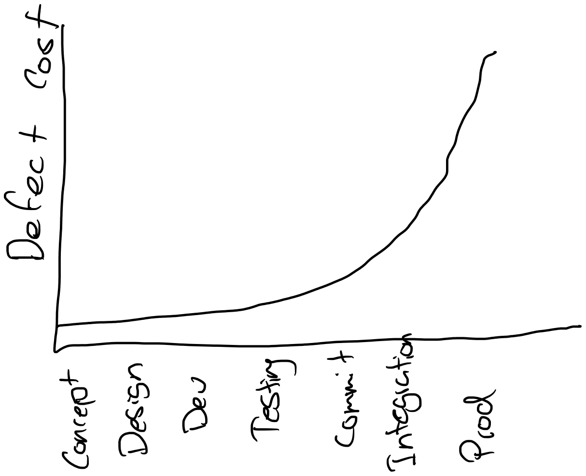

# Software Engineering at Google
__By: Titus Winters, Tom Manshreck and Hyrum Wright__
## Lessons Learned:
- shifting work left means you move work towards the beginning of the development process, where fixing issues is much cheaper.

- Google uses something called go / links that connect to specific documentation on a tropic. For example go / python would be their internal python developers guide. If the actual content is moved, the actual go / link remains the same for the user using it, but they might just be directed to a new location. Much easier to tell someone in person and guess the link yourself.
- if you are the motivated, impatient type, you are very likely to find yourself into a leadership role. You might get sucked into helping resolve conflicts, make decisions, and coordinate people. Some people call this manageritis.
- Google leadership tips and tricks
	- delegate, but get your hands dirty
	- seek to replace yourself
	- know when to make waves tackle a difficult situation and when to let things sit
	- shield the team from the chaos of the organization. Also, know when to inform the team and when to keep unnecessary distractions from them
	- let the team know when they are doing well.
	- develop the skill of finding small a small yes. Instead of rewriting the entire thing, find small items you can agree to.
- each employee is different. So they will each need a different blend of motivation and direction.
- know the difference between intrinsic and extrinsic motivation
	- ways to increase intrinsic motivation by giving people more autonomy, mastery, and purpose
- the three always of leadership:
	- always be deciding- even after making a decision, iterate on it. Evaluate how well things went and then make another decision. Understand the trade offs.
	- always be leaving- you need to be thinking about who can take your job when you move on and making sure that person is ready.
	- always be scaling - think through low you manage your time and the work you do. Because so many things head your way throughout the week, you need to focus on doing the work that only you can do.
- need to set meaning fun metrics using goals and signals
	- a goal is a derived end result.
		- example: engineer writes higher-quality code as a result of the readability process
	- a signal is how you might know if you have met your goal. Signals are things we wish we could measure, but cannot
		- example: engineers who have been granted readability judge their code to be of higher quality than engineer who have not bee granted readability
	- a metric is a proxy for a signal. Not ideal but close enough because we can actually measure it
		- example: survey or log data.
- every directory, or project, has an owner. This owner needs to give the thumbs up before and code is messed into the development branch. They are usually team leads and very knowledgeable on the directory they own. Their name can be found in a special file so that any one can see who owns a directory. This is a very important part of the code review process.
- code review also needs to so through a language specific expert to make scree it follows all internal guides specific to that language. Very often there is an overlap between directory owner and language expert.
- documentation should be treated like code.it should:
	- have policies that should be followed
	- be placed in source control
	- clean ownership
	- be reviewed after changes
	- have issue tracking numbers
- engineers should aim for 80% of tests unit tests, while end to end tests and integration tests should take up the other 20%
- tests need to be complete and concise. Complete in that the test contains all of the information a reader needs in order to understand how it arrives at its result. Concise in that it contains no other distracting or irrelevant information.
- tests should be written when thinking about behavior, not methods. Behaviors can often be expressed using the words given, when, and then.
- in test code, stick to straight-line code over clever logic, and consider tolerating some duplication when it makes the test more descriptive and meaningful
- test doubles refer to objects or functions that stand in the real object or function, just like a stand double. Similar to the mocking concept.
- when building a new system think about its eventual deprecation by answering these questions:
	- how easy will it be for my users to migrate to a potential replacement?
	- how can I replace parts of my system incrementally?
- Google uses trunk based development because they have so many developers using their monorepo.
- for Google's monorepo they use a tool called critique for code review. For some of their internal tools as well as open source projects like chrome and android, they use an open source tool called gerrit.
- static code analysis refers to the analysis of source code to find potential issues without executing the program. Potential issues include bugs, antipatterns, and other issues.
- avoid haunted graveyards, which is code or systems that are so old, obtuse, or complex that no one dares touch it. They are often business critical and so never see any type of updates because of fear of strange issues or crashing. The best way to avoid this is by writing effect tests.

- the value of code is not realized once it is merged, but rather when it is delivered to an end user.
- with quality continuous delivery processes, how often a viable release is created can be de-coupled from how often a user receives that release. Same idea that you don't have to deliver every release to users, but you should have the ability to do so.
- 

  